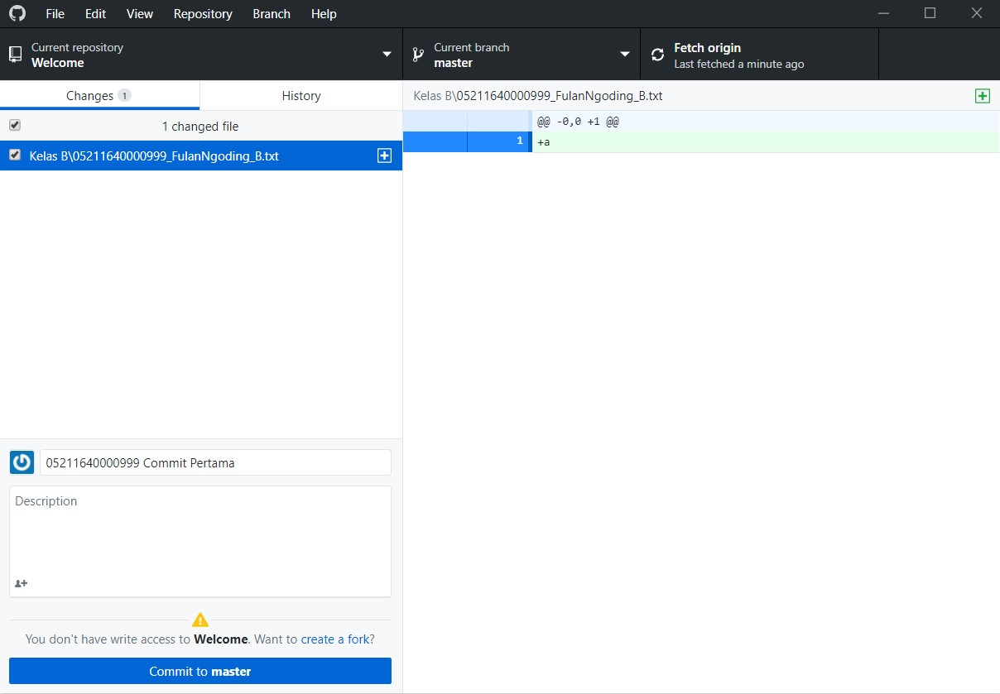
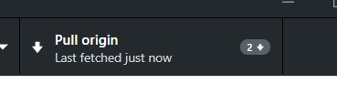

# Praktikum Desain Pengalaman Pengguna 2020

Halo, selamat datang di praktikum Desain Pengalaman Pengguna! Repository ini akan menjadi tempat kalian melihat dan mengumpulkan tugas praktikum. 


## Getting Started 😉

Target kalian dalam praktikum ini adalah membuat mockup dengan template berbasis bootstrap. Selama semester ini akan ada kurang lebih 7 sesi praktikum yang akan kalian lalui. *Without further a do, let's get started!*

### Persiapan

Ada beberapa hal yang perlu kalian persiapkan untuk praktikum ini, yaitu:

1. Sudah punya akun Github? Kalau belum daftar dulu di sini ya: https://github.com/join. 
2. Download dan Install Github Desktop: https://desktop.github.com/
3. Pastikan sudah memiliki *code editor* yang ter-instal di laptop kalian untuk mempermudah editing file bootstrap. Jika belum, kami merekomendasikan VSCode (https://code.visualstudio.com/)

### Tugas Pertama Kalian 

> Sebelum kalian melakukan hal di bawah ini, pastikan kalian telah menyelesaikan seluruh tahap persiapan. Pastikan juga Github Desktop sudah terinstal dengan baik dan sudah melakukan login menggunakan akun github kalian.

1. **Melakukan Clone Menggunakan Repository DPP-2020/Welcome**

    Buka Github Desktop kalian. Lalu jalani langkah berikut untuk melakukan Clone Repository

    ```
    File > Clone Repository > Pilih tab URL > Masukkan 'DPP2020/Welcome' tanpa tanda petik di kolom Repository > Pilih Local Path dengan Folder di tempat yang paling mudah dijangkau kalian (misal. di folder perkuliahan)
    ```
    
2. **Membuat File Text Baru**

    Selanjutnya buka folder tempat di mana kalian menyimpan repository ini. Lalu buatlah sebuah file notepad baru dengan format **NRP_NamaLengkap_Kelas.txt** pada folder sesuai dengan kelas kalian. FILE TIDAK PERLU DIISI TEXT APAPUN.

    ```
    Contoh Nama File: 05211640000999_FulanNgoding_A.txt
    ```
    
 3. **Melakukan Commit dan Push**

    Buka kembali Github Desktop kalian, Kemungkinan besar tampilannya akan seperti ini
    
    
    
    Kita akan melakukan **Commit** namun sebelumnya isikan keterangan commit kalian dengan format **NRP Commit Pertama** sebagai mana contoh pada gambar di atas. Deskripsi dapat dikosongkan.
    
    Jika sudah, maka kita bisa lakukan push sehingga file kalian dapat terunggah pada repository DPP-2020/Welcome
    
    
   
Selesai! Pastikan file kalian telah terunggah dengan melihat pada tab **History** di Github Desktop atau dapat mengecek langsung pada link repository ini (https://github.com/DPP-2020/Welcome)

----

***Eh Kok di aku keluar ada tulisan Pull' ya?***



Jangan khawatir, ini tandanya folder kalian sedang ingin menyesuaikan dengan file terbaru yang ada di dalam repository ini. **Pull** akan mendownload semua file baru yang sudah di **Push** oleh pengguna lain sehingga isi folder kalian tetap tersinkronisasi dengan file terbaru. Kami sarankan sebelum melakukan **commit** baru maka lakukanlah **pull** untuk memastikan tidak ada *file conflict* nantinya.

### Ih keren kamu udah jago sekarang 👍👍👍

Sip! Itu dia tadi sekilas tentang bagaimana kamu nantinya akan menggunakan GitHub selama praktikum. Nah, karena kamu sudah siap sekarang saatnya untuk misi kedua kalian di praktikum ini! Ada tantangan selanjutnya buat kalian yang bisa diikuti di link ini:

```
https://classroom.github.com/a/e_uVfW9W
```

## Ohiya, mau tanya-tanya bisa kemana nih?

Kamu bisa langsung ke mas-mas asisten praktikum DPP sesuai kelas masing-masing ya!
* DPP-A : x, y, z
* DPP-B : x, y, z
* DPP-C : x, y, z
* DPP-D : x, y, z
